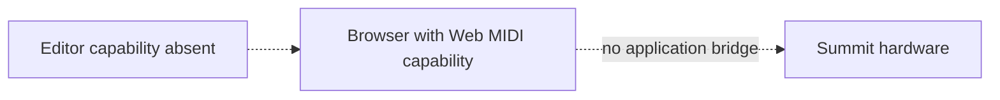
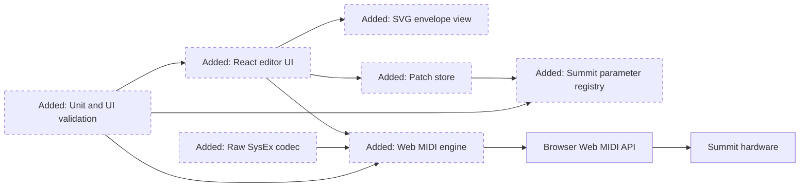
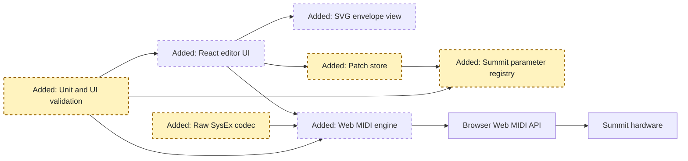
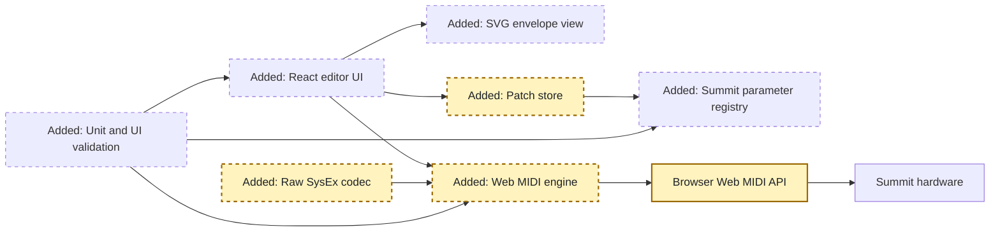
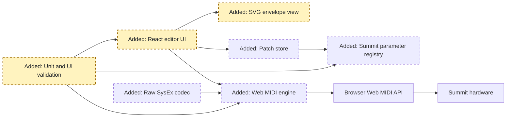

<!-- markdownlint-disable-file -->
# RPI Plan: Summit Editor Scaffold

## Task Metadata

* Task ID: summit-editor-scaffold
* Task slug: summit-editor-scaffold
* Plan date: 2026-10-06

## Executive Summary

* Bottom line: Plan a runnable React and TypeScript Summit editor that discovers MIDI devices, sends verified CC and NRPN changes, reflects inbound CC values, previews the amplitude envelope, and handles raw SysEx files behind a stable transport boundary.
* Why this matters: The first release becomes useful with hardware while preserving clear expansion paths for parsed patch dumps, wavetable graphics, modulation views, multis, and librarian workflows.
* Planning result: Drafting from complete research; no current blocker.
* Confidence and uncertainty: High for browser transport and live parameter controls; raw patch request framing requires hardware validation and parsed dump fields remain out of scope.

### What You May Not Know

* Web MIDI requires a secure context and explicit permission, and Safari has no native support.
* The official guide documents live CC and NRPN parameters, while complete patch-dump field decoding is not publicly specified in the verified sources.

## Phase Checklist

### Before

### After

The plan adds a browser application between the Web MIDI API and Summit hardware. Typed schema and transport contracts keep the UI, patch state, visualization, and future dump parsing independent.

<!-- rpi:phase id=P01 -->
### [x] P01: Establish the application and domain contracts

Goals:
* Create a tested TypeScript foundation where Summit parameter metadata, MIDI encoders, raw SysEx boundaries, and patch state are independent of browser hardware and UI composition.

Dependencies:
* Node.js and npm.

Highlighted work: add the project foundation, typed registry, patch store, SysEx codec contract, and unit-test harness.

<!-- rpi:task id=P01-T01 -->
#### [x] P01-T01: Scaffold the browser application and validation toolchain

Goals:
* Produce a runnable Vite React application with strict TypeScript, lint, unit-test, DOM-test, and production-build commands.

Requirements:
* NFR-001, NFR-002, NFR-005.
* The project must run through `npm run dev`, validate through `npm test -- --run` and `npm run lint`, and build through `npm run build`.
* Production dependencies may include React, Zustand, and Lucide; test dependencies may include Vitest, Testing Library, jsdom, axe, and Playwright.

Details:
* Use the Vite React TypeScript template in the empty workspace, then add only dependencies needed by the approved slice.
* Preserve a fully local browser application. Do not add server routes, databases, authentication, or environment secrets.

References:
* [.copilot-tracking/research/2026-10-06/summit-editor-scaffold-research.md](../../research/2026-10-06/summit-editor-scaffold-research.md): C1 confirms the workspace is empty; the recommendation selects the toolchain.

Dependencies:
* None.

<!-- rpi:task id=P01-T02 -->
#### [x] P01-T02: Define parameter, message, patch, and SysEx contracts

Goals:
* Make documented Summit parameters and MIDI encodings reusable by state, transport, controls, and tests without UI-specific logic.

Requirements:
* FR-003, FR-005, FR-007, FR-008, NFR-001.
* The parameter registry must encode stable IDs, sections, labels, defaults, ranges, display mappings, and either a documented CC or NRPN address.
* CC encoding must emit one channel voice message. NRPN encoding must emit parameter MSB/LSB followed by data entry MSB/LSB using 14-bit values.
* Raw SysEx validation must accept complete `F0 ... F7` messages and reject malformed or non-SysEx data without sending it.
* Unit tests own semantic encoding and registry coverage. No snapshot-only test may substitute for byte-level assertions.

Details:
* Include representative controls for oscillator wave and shape, filter resonance and drive, amp ADSR, LFO rate or wave, and effect levels using only official mappings from W3.
* Keep the independent edit-buffer request in a named experimental codec function with its provenance and hardware-validation limitation exposed to the UI.
* Exact removals: none. Maximum architectural additions: one registry module, one codec module, one patch-store module, and colocated tests, excluding generated scaffold files.

References:
* [.copilot-tracking/research/2026-10-06/summit-editor-scaffold-research.md](../../research/2026-10-06/summit-editor-scaffold-research.md): W3 provides official CC/NRPN mappings; W4 bounds experimental request framing.

Dependencies:
* P01-T01.

<!-- rpi:phase id=P02 -->
### [x] P02: Integrate browser MIDI and patch workflows

Goals:
* Connect domain contracts to browser MIDI so device lifecycle, real-time parameter changes, inbound reflection, and raw SysEx operations work through one observable service boundary.

Dependencies:
* P01.

Highlighted work: integrate the MIDI engine with browser ports, the store, documented encoders, and raw SysEx operations.

<!-- rpi:task id=P02-T01 -->
#### [x] P02-T01: Implement MIDI capability and port lifecycle

Goals:
* Expose deterministic capability, permission, connection, port, and error state that remains usable when hardware or Web MIDI is absent.

Requirements:
* FR-001, FR-002, NFR-004, NFR-005.
* Access must be requested only from a user action with `{ sysex: true }`.
* Port maps must refresh on MIDI `statechange`; selected ports must be cleared or replaced when disconnected.
* Input listeners must be detached when selection changes or the owning component unmounts.
* Errors must become visible state and must not be swallowed or logged as the only feedback.

Details:
* Wrap browser MIDI types behind a service interface so unit tests can use fake ports without hardware.
* Treat unsupported browsers as an expected state. Do not polyfill Safari or require MIDI access to render the editor.

References:
* [.copilot-tracking/research/2026-10-06/summit-editor-scaffold-research.md](../../research/2026-10-06/summit-editor-scaffold-research.md): W1 and W2 establish security, permission, events, and compatibility constraints.

Dependencies:
* P01-T02.

<!-- rpi:task id=P02-T02 -->
#### [x] P02-T02: Connect parameter changes, inbound messages, and raw patch data

Goals:
* Send local edits to the selected output, reflect incoming documented CC values without feedback loops, and support bounded raw SysEx file operations.

Requirements:
* FR-003, FR-004, FR-007, NFR-001.
* Local changes must clamp values to registry ranges before store update and MIDI send.
* Inbound CC messages on the selected channel must update matching single-CC parameters with source metadata that prevents echo.
* Imported files must be size bounded, parsed as raw bytes, and validated as complete SysEx before they can be sent or exported.
* Valid inbound SysEx messages must be captured as the current raw patch and exported byte-for-byte unchanged; malformed or incomplete SysEx must not replace the current patch.
* The edit-buffer request action must be labeled experimental until verified with Summit hardware.
* Tests must cover fake-port send bytes, inbound CC updates, inbound SysEx capture and unchanged export, listener cleanup, invalid SysEx rejection, and offline behavior.

Details:
* Keep file I/O in the UI/application edge and byte validation in the codec. Do not decode unverified patch fields.
* Hardware validation is expected to remain pending in this environment; preserve exact diagnostic bytes for later device testing.

References:
* [.copilot-tracking/research/2026-10-06/summit-editor-scaffold-research.md](../../research/2026-10-06/summit-editor-scaffold-research.md): the raw SysEx finding and D3 define the safety boundary.

Dependencies:
* P02-T01.

<!-- rpi:phase id=P03 -->
### [x] P03: Deliver and verify the editor experience

Goals:
* Present the working architecture as a responsive, accessible, visually intentional editor with clear connection, editing, visualization, and raw patch workflows.

Dependencies:
* P02.

Highlighted work: build the full editor surface, envelope visualization, accessibility behavior, responsive styling, and browser-level validation.

<!-- rpi:task id=P03-T01 -->
#### [x] P03-T01: Build the responsive editor surface

Goals:
* Let users understand connection state, select ports and channels, edit grouped parameters, inspect the envelope, manage raw patches, and reset defaults from one efficient workspace.

Requirements:
* FR-001, FR-002, FR-003, FR-004, FR-005, FR-006, FR-007, FR-008, NFR-003, NFR-004, NFR-005.
* Use native labeled controls, semantic sections, visible focus, status announcements, and icon tooltips where text alone is not appropriate.
* The envelope visualization must provide an accessible text alternative and stable dimensions so value updates do not shift the layout.
* Reset must update all registered values in one local state transaction and, when an output is selected, send each documented default to the Summit; offline reset must remain local-only.
* Mobile and desktop layouts must not overlap, clip labels, or require horizontal page scrolling at 360px width.
* Browser support and experimental fetch limitations must be visible near the affected workflow, not hidden in developer documentation.

Details:
* Use a restrained instrument-panel visual language with clear sections and selective color accents, avoiding decorative cards nested inside cards.
* Drive repeated parameter controls from the registry. Keep component code free of raw controller numbers.
* Use Lucide icons for connect, refresh, import, export, send, and reset actions where appropriate.

References:
* [.copilot-tracking/research/2026-10-06/summit-editor-scaffold-research.md](../../research/2026-10-06/summit-editor-scaffold-research.md): findings define capability states, registry-driven controls, and SVG visualization.

Dependencies:
* P02-T02.

<!-- rpi:task id=P03-T02 -->
#### [x] P03-T02: Validate behavior, accessibility, responsiveness, and production output

Goals:
* Establish executable evidence that the minimum editor works offline, encodes messages correctly, renders at target viewports, and produces a deployable static build.

Requirements:
* NFR-001 through NFR-005.
* `npm test -- --run`, `npm run lint`, and `npm run build` must pass.
* Component tests must cover unsupported, idle, ready, and error states plus keyboard-accessible primary actions.
* Integration tests must verify connected reset sends registered defaults once and offline reset sends no MIDI while updating local state.
* Playwright must capture desktop and 360px mobile screenshots, run an accessibility scan, and verify no page-level horizontal overflow.
* Visual checks must inspect control text, status content, envelope rendering, and action availability in both viewports.
* No hardware-only assertion may be represented as passed without real Summit evidence.

Details:
* Unit and DOM tests are canonical for behavior. Browser screenshots and accessibility checks are regression evidence for presentation.
* Start a local Vite server for browser validation and leave a runnable URL for the user.

References:
* [.copilot-tracking/research/2026-10-06/summit-editor-scaffold-research.md](../../research/2026-10-06/summit-editor-scaffold-research.md): risks require explicit offline and browser-support validation.

Dependencies:
* P03-T01.

## User Decisions and Requirements

### Confirmed User Direction

* Build a clean, practical scaffold for a web-based Novation Summit patch editor.
* Keep the app browser-only with no backend.
* Support real-time Summit control through NRPN and CC.
* Establish SysEx fetch and save boundaries without inventing undocumented patch fields.
* Include visual foundations for envelopes and future wavetable and modulation views.
* Keep layers modular so multis, librarian features, and morphing can be added later.

### Planning Decisions and Feedback

| Group | Decision or feedback item | Status | Owner | Rationale or input needed | Evidence | Planning impact |
|-------|---------------------------|--------|-------|---------------------------|----------|-----------------|
| D1 | Use React, TypeScript, Vite, and Zustand. | Confirmed | Agent | Matches the event-driven layered architecture with low state overhead. | Research C1, W1, W3 | Controls all phases. |
| D2 | Implement documented single CC and NRPN mappings; defer CC-pair values. | Confirmed | Agent | Proves both protocols without introducing unresolved high-resolution value semantics. | Research W3 | Bounds P01 and P02. |
| D3 | Keep SysEx data raw behind transport and codec interfaces. | Confirmed | Agent | Public field evidence is incomplete and independent framing is alpha quality. | Research W3, W4 | Bounds P02. |

## Planning Readiness and Next Step

| Field | Record |
|-------|--------|
| Planning execution and readiness | Complete and Ready; the standard critique findings are resolved in P02-T02 and P03-T01/P03-T02. |
| Decision participation | agent-owned from automatic Handle it end to end mode |
| Blockers | None. |
| Latest critique | [.copilot-tracking/reviews/plans/2026-10-06/summit-editor-scaffold-plan-critique.md](../../reviews/plans/2026-10-06/summit-editor-scaffold-plan-critique.md) with Revise; PC-001 and PC-002 are resolved directly. |
| Relevant research | [.copilot-tracking/research/2026-10-06/summit-editor-scaffold-research.md](../../research/2026-10-06/summit-editor-scaffold-research.md) |
| Plan | `.copilot-tracking/plans/2026-10-06/summit-editor-scaffold-plan.md` |
| Changes-record role | `.copilot-tracking/changes/2026-10-06/summit-editor-scaffold-changes.md` is implementation evidence. |
| Continuation owner | confirmed automatic RPI Agent |
| Required gates or confirmations | Plan complete; standard critique complete; all findings resolved; no exceptional confirmation required. |
| Next action | Automatic RPI parent transitions to Review. |

## Goals

* Deliver a runnable, responsive, keyboard-accessible editor shell that can communicate with Summit hardware through supported desktop browsers.
* Keep MIDI transport, parameter metadata, patch state, visualizations, and UI composition independently testable.
* Prove the architecture with documented CC and NRPN controls, inbound reflection, an envelope visualization, and raw SysEx file operations.

## Scope and Non-Goals

### In Scope

* Vite React and TypeScript scaffold with linting, unit tests, and production build.
* Web MIDI capability, permission, port selection, device state changes, message sending, and inbound CC handling.
* Typed parameter registry with representative oscillator, filter, envelope, LFO, and effects controls.
* Raw SysEx edit-buffer request, import, export, and send boundaries with clear validation status.
* Responsive editor interface and SVG amplitude-envelope preview.

### Non-Goals

* Complete binary patch parsing or generated full parameter coverage.
* CC-pair high-resolution controls, multi patches, librarian browsing, morphing, custom wavetable editing, or modulation graph editing.
* Backend services, accounts, cloud storage, or Safari support.

## Functional Requirements

* FR-001: A user can request MIDI access with SysEx permission and see unsupported, requesting, ready, and error states.
* FR-002: A user can select available MIDI input and output ports and the list updates when devices change.
* FR-003: Changing a registered parameter updates local patch state and sends the documented CC or NRPN message on the selected channel.
* FR-004: Incoming registered CC messages update the corresponding visible patch value without echoing the message back.
* FR-005: The editor exposes documented controls across oscillator, filter, amplitude envelope, LFO, and effects domains.
* FR-006: The amplitude-envelope visualization updates from attack, decay, sustain, and release values.
* FR-007: A user can request the current edit buffer, import a `.syx` file, export captured raw SysEx, and send imported raw SysEx when an output is selected.
* FR-008: A user can reset the visible patch values to the registry defaults.

## Non-Functional Requirements

* NFR-001: MIDI encoding and parameter mapping are unit tested independently from browser hardware.
  * Objective threshold or evaluation condition: Tests cover CC, NRPN, inbound CC mapping, SysEx framing validation, and rejected invalid values.
  * Operating condition or verification approach: `npm test -- --run` passes without hardware.
* NFR-002: The production application builds with strict TypeScript and lint checks.
  * Objective threshold or evaluation condition: `npm run build` and `npm run lint` succeed.
* NFR-003: The primary workflow remains usable from 360px mobile width through desktop without overlapping controls.
  * Objective threshold or evaluation condition: Browser screenshots at representative mobile and desktop viewports show no clipping or incoherent overlap.
* NFR-004: Interactive controls expose visible labels, keyboard operation, focus indicators, and status announcements.
  * Objective threshold or evaluation condition: Automated accessibility checks and keyboard inspection find no critical issues in the primary screen.
* NFR-005: Hardware absence does not prevent interface exploration or unit validation.
  * Objective threshold or evaluation condition: The app renders controls and visualizations with a clear offline state when Web MIDI is unsupported or permission is not granted.

## Risks and Open Questions

| Priority | Type | Risk, question, or planning item | Affected work | Impact | Smallest action or evidence needed | Owner |
|----------|------|----------------------------------|---------------|--------|------------------------------------|-------|
| H | Risk | No Summit hardware is available in this environment. | P02-T02 | Real device behavior and request response cannot be proven. | Mark hardware validation pending and preserve diagnostics for later device testing. | Downstream |
| M | Risk | Independent edit-buffer request framing is alpha quality. | P02-T02 | A request may not work on all firmware versions. | Unit test exact bytes, label the action experimental, and require hardware verification before claiming full fetch support. | Implementation |
| M | Risk | Web MIDI browser support is limited. | P02-T01, P03-T01 | Some users cannot connect. | Present supported-browser guidance in the capability state. | Implementation |

## Dependencies

* Node.js and npm: required to scaffold, test, build, and run the Vite project.
* Current Chrome, Edge, or Firefox desktop: required for Web MIDI hardware access.
* Summit hardware: required only for final real-device validation, not scaffold completion.

## Sources

* [.copilot-tracking/research/2026-10-06/summit-editor-scaffold-research.md](../../research/2026-10-06/summit-editor-scaffold-research.md): architecture decision, official parameter evidence, browser constraints, and SysEx boundary.
* User request: layered architecture, real-time control, SysEx, visualizations, modularity, and zero-backend constraint.

## Critique Disposition

* Critique setting and provenance: standard; default for the automatic RPI session.
* Critique status: Complete.
* Latest critique and verdict: .copilot-tracking/reviews/plans/2026-10-06/summit-editor-scaffold-plan-critique.md with Revise.
* Earlier critiques: None.
* Limitations: Source implementation and real Summit behavior were unavailable during critique.

| Critique run and finding | Disposition | Action owner | Exact resolving evidence | Decision route | Plan response or residual risk |
|--------------------------|-------------|--------------|--------------------------|----------------|--------------------------------|
| Initial PC-001 | Resolved | Planning parent | P02-T02 requires inbound SysEx capture, unchanged export, rejection, and tests. | Direct correction | Fetch now has an observable response path; hardware behavior remains pending. |
| Initial PC-002 | Resolved | Planning parent | P03-T01 and P03-T02 define connected and offline reset semantics and tests. | Direct correction | Reset behavior is deterministic and testable. |

## Artifact Self-Check

* [x] Executive Summary, What You May Not Know, and the Phase Checklist come first and are understandable without reading the supporting sections.
* [x] Confirmed direction, grouped decisions, readiness, goals, scope, requirements, risks, and dependencies are current and consistent with the Phase Checklist.
* [x] Planning decision participation and provenance are recorded; user-owned and user-retained groups have persisted answers, while agent-owned groups have evidence-backed rationales or honest blockers.
* [x] Functional and non-functional requirements are current, and every `FR-nnn` and `NFR-nnn` is cited by at least one task's Requirements.
* [x] Every phase and task contains the required blocks and diagrams.
* [x] Open decisions, risks, and questions live in their tables with affected task IDs.
* [x] Existing paths are linked and planned paths use code formatting.
* [x] Diagrams use stable IDs and prescribed theme variables.
* [x] Risks, blockers, critique findings, and residual risks have owners and next actions.
* [x] Critique and handoff records are complete.
* Checked sections: All required plan, phase, task, requirement, risk, critique, and handoff sections.
* Missing or limited sections: Dual-theme Mermaid rendering was not previewed; real Summit behavior remains a downstream validation limit.

## Follow-Up Items

* None

## Handoff

* Authoritative implementation handoff: Planning Readiness and Next Step
