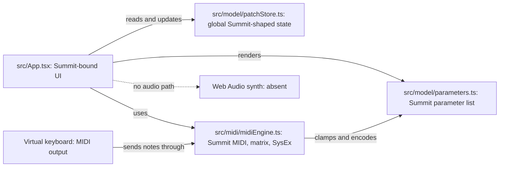
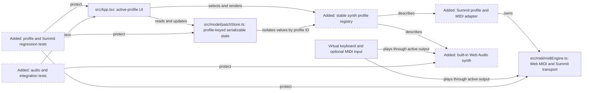
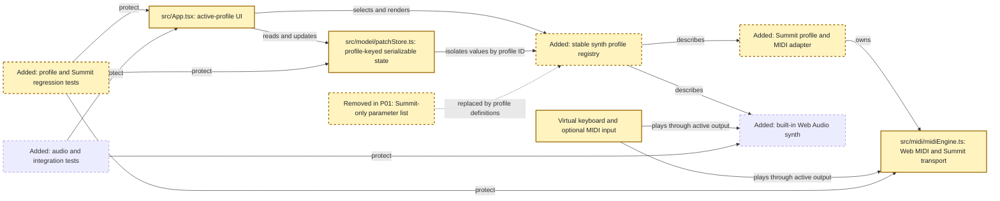
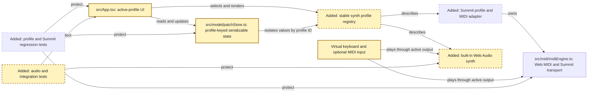

<!-- markdownlint-disable-file -->
# RPI Plan: Multi-synth patch lab foundation

## Task Metadata

* Task ID: multi-synth-patch-lab
* Task slug: multi-synth-patch-lab
* Plan date: 2026-10-09

## Executive Summary

* Bottom line: Plan a two-phase foundation: profile-based Summit compatibility first, followed by a built-in Web Audio synthesizer. Keep hosting flexible and state serializable without adding platform services or freezing a patch-sharing format.
* Why this matters: This preserves existing hardware editing while establishing a no-hardware instrument and a profile boundary that can evolve into tutorials and patch sharing later.
* Planning result: The phase/task plan is drafted from completed research. Readiness awaits an independent standard critique and final consistency checks.
* Confidence and uncertainty: High confidence in existing code boundaries and validation surfaces; audio behavior and scope need browser listening checks, while future identity, cloud, sharing, and gamification remain out of this foundation.

### What You May Not Know

* Web MIDI is permission-gated and not universally available, so the built-in audio mode cannot depend on successful MIDI initialization.
* The Summit editor currently owns its SysEx and modulation-matrix behaviors; profile generalization must preserve those hardware-specific capabilities rather than expose them on the web synth.
* Stable profile IDs and serializable profile-specific state are in scope. Persistent storage, a versioned exchange contract, accounts, cloud services, patch sharing, and tutorials are not.

## Phase Checklist

### Before

### After

The Summit editor remains available through an explicit profile, while a profile-keyed state boundary and a separate browser-audio output path enable the built-in synth. MIDI availability remains optional for audio playback.

<!-- rpi:phase id=P01 -->
### [ ] P01: Establish profile-based model and preserve Summit editing

Goals:
* Replace implicit Summit-only model assumptions with explicit stable synth profiles while retaining Summit hardware editing as a complete profile. This establishes a safe foundation for adding the web synth without forcing future platform services or a cross-device patch contract.

Dependencies:
* None.

Highlighted work: replace implicit Summit coupling in the UI, profile metadata, patch state, and hardware MIDI boundary. The built-in synth remains a later phase.

<!-- rpi:task id=P01-T01 -->
#### [ ] P01-T01: Define stable profile and parameter contracts

Goals:
* Profiles have stable identities, profile-owned parameter definitions/defaults, and declared capabilities so the UI and state layer can address devices without deriving identity from the Summit parameter array.

Requirements:
* FR-001, FR-002, NFR-003.
* Summit and built-in web synth profile identifiers are stable code-level IDs, independent of display names or deployment host.
* Parameter definitions do not require MIDI addresses; Summit MIDI encodings remain available through Summit-specific metadata.
* Profile definitions distinguish supported controls/capabilities so Summit-only modulation/SysEx features do not appear as generic web-synth requirements.

Details:
* Existing [src/model/parameters.ts](../../../src/model/parameters.ts) combines Summit presentation, defaults, and hardware MIDI address metadata; `ParameterId` and defaults derive from the Summit list.
* Define a profile-neutral parameter identity/type while preserving useful Summit metadata and types. Keep the profile contract small: stable ID, parameter definitions/defaults, and explicit capabilities/UI organization needed by current work.
* No plugin loader, runtime registration API, universal parameter taxonomy, or profile serialization format is required; local typed registration is sufficient.

References:
* [src/model/parameters.ts](../../../src/model/parameters.ts): current parameter type and Summit definition.
* [.copilot-tracking/research/2026-10-09/multi-synth-patch-lab-research.md](../../research/2026-10-09/multi-synth-patch-lab-research.md):
  * Findings 1–3 and evidence C1, C6, C8: Summit IDs, controls, and MIDI metadata are currently coupled.

Dependencies:
* None.

<!-- rpi:task id=P01-T02 -->
#### [ ] P01-T02: Isolate profile-specific patch state

Goals:
* Editing values in one profile leaves another profile's values untouched, and the in-memory profile state can be represented as plain serializable values without adding persistence.

Requirements:
* FR-002, NFR-003.
* Parameter values are keyed by stable profile ID and are clamped against the selected profile's definitions.
* Summit modulation matrix and opaque raw SysEx payload/source remain Summit-specific and are not presented as a universal patch state.
* Web-synth parameter state is plain JSON-compatible data; no storage service, schema migration, or sharing envelope is introduced.

Details:
* Existing [src/model/patchStore.ts](../../../src/model/patchStore.ts) holds one global value map, a 16-slot Summit matrix, and optional copied SysEx bytes; setters use a Summit-only lookup.
* Preserve established store actions where they remain meaningful, and keep consumers able to address the current profile. Treat serializability as a value-shape constraint, not a new persistence API.
* Add store/profile-switch coverage for isolation, defaults, clamping, reset, and Summit-only payload behavior.

References:
* [src/model/patchStore.ts](../../../src/model/patchStore.ts): existing state, action, clamping, and reset behavior.
* [src/model/patchStore.test.ts](../../../src/model/patchStore.test.ts): current store test patterns.
* [.copilot-tracking/research/2026-10-09/multi-synth-patch-lab-research.md](../../research/2026-10-09/multi-synth-patch-lab-research.md):
  * Finding 3 and evidence C7, C13–C16: global Summit state and absent persistence/identity boundaries.

Dependencies:
* P01-T01.

<!-- rpi:task id=P01-T03 -->
#### [ ] P01-T03: Preserve Summit MIDI behavior behind a profile adapter

Goals:
* Summit editing and hardware communication continue to work through profile-specific MIDI behavior instead of making Summit encoding rules universal.

Requirements:
* FR-003, NFR-002.
* Summit parameter CC/NRPN updates, inbound reflection, matrix handling, reset, SysEx capture/import/export, and MIDI note output retain current behavior.
* MIDI availability and permission errors remain separate from built-in audio readiness.
* Existing codec and MIDI-engine regression cases pass; tests cover profile dispatch and Summit-specific operations.

Details:
* Existing [src/midi/midiEngine.ts](../../../src/midi/midiEngine.ts) combines generic Web MIDI port management with Summit-specific encoding, decoding, matrix, reset, and SysEx behavior.
* Retain a clear Summit-specific driver/adapter boundary around those behaviors. Do not make a generic audio/MIDI transport protocol that hides the distinct scheduling and message semantics.
* Keep unsupported or denied Web MIDI visible as a MIDI capability state; it must not become a failure of profile metadata or Web Audio.

References:
* [src/midi/midiEngine.ts](../../../src/midi/midiEngine.ts): current MIDI and Summit-specific operations.
* [src/midi/codec.test.ts](../../../src/midi/codec.test.ts) and [src/midi/midiEngine.test.ts](../../../src/midi/midiEngine.test.ts): existing codec and engine regression coverage.
* [.copilot-tracking/research/2026-10-09/multi-synth-patch-lab-research.md](../../research/2026-10-09/multi-synth-patch-lab-research.md):
  * Findings 2–3 and evidence C8, C10, W4: transport-specific behavior and optional Web MIDI availability.

Dependencies:
* P01-T01, P01-T02.

<!-- rpi:task id=P01-T04 -->
#### [ ] P01-T04: Select and render the active profile

Goals:
* Users can select a registered synth profile, and the app renders the active profile's own controls and available hardware-specific sections.

Requirements:
* FR-001, FR-002, FR-003, NFR-001, NFR-002.
* Summit remains available and retains current editor controls, modulation matrix, keyboard note lifecycle, reset, and raw SysEx workflows.
* Profile selection uses stable IDs and keeps each profile's edits isolated.
* The UI and profile registry do not require a GitHub Pages path or backend service.

Details:
* Existing [src/App.tsx](../../../src/App.tsx) directly renders Summit sections and ties its virtual keyboard to a selected MIDI output. P01 registers Summit; P02 adds the built-in synth profile.
* Keep reusable controls where appropriate, but profile-specific panel composition belongs with the selected profile. Keep audio status and MIDI status separate.
* Existing app and keyboard tests exercise the behaviors to preserve. This task should keep accessibility semantics and control labels intact while adding profile selection.

References:
* [src/App.tsx](../../../src/App.tsx): current Summit-bound composition and virtual keyboard enablement.
* [src/App.test.tsx](../../../src/App.test.tsx) and [src/App.midiStates.test.tsx](../../../src/App.midiStates.test.tsx): app and MIDI/keyboard regression coverage.
* [vite.config.ts](../../../vite.config.ts): configurable `VITE_BASE_PATH` deployment behavior.

Dependencies:
* P01-T01, P01-T02, P01-T03.

<!-- rpi:phase id=P02 -->
### [ ] P02: Add an independent built-in Web Audio synth

Goals:
* A user can play and shape the built-in synth without hardware or Web MIDI, while sharing the profile-aware editing and keyboard experience established in P01.

Dependencies:
* P01.

Highlighted work: add the built-in audio engine and route active-profile keyboard performance to it. Summit MIDI remains a separate output.

<!-- rpi:task id=P02-T01 -->
#### [ ] P02-T01: Define the web-synth profile and playable controls

Goals:
* The built-in profile exposes its own defaults, presets, and controls for shaping the specified two-oscillator subtractive synth.

Requirements:
* FR-001, FR-002, FR-004, FR-007, NFR-003.
* The web synth has two selectable waveform oscillators per voice, detune, low-pass filter cutoff/resonance/filter-envelope amount, amp and filter ADSR, and a shared pitch/filter LFO.
* Initial built-in presets are available and apply complete profile-specific values.
* Web-synth controls do not expose Summit-only matrix or SysEx actions.

Details:
* No audio graph or synth parameter schema currently exists in source. Keep the web synth's parameter definitions independent of Summit MIDI addresses and use plain serializable parameter state.
* Implementer may choose a small useful initial preset set and appropriate parameter ranges/defaults consistent with the stated synth controls; no cross-device compatibility is implied.

References:
* [src/model/parameters.ts](../../../src/model/parameters.ts): existing parameter definitions to compare with and avoid extending into an audio/hardware conflation.
* [.copilot-tracking/research/2026-10-09/multi-synth-patch-lab-research.md](../../research/2026-10-09/multi-synth-patch-lab-research.md):
  * Findings 1, 3–4 and evidence C6–C7, C11, C13–C16: profile-specific values and no existing audio implementation.

Dependencies:
* P01-T01, P01-T02, P01-T04.

<!-- rpi:task id=P02-T02 -->
#### [ ] P02-T02: Implement bounded polyphonic audio and modulation

Goals:
* The web-synth profile produces bounded, polyphonic sound with predictable note release and smooth modulation.

Requirements:
* FR-004, FR-005, NFR-004.
* At most eight notes sound simultaneously; note-off and panic release active voices without leaving stuck notes.
* Each active voice contains two independently selectable waveform oscillators and the specified filter/envelope behavior; one shared LFO can modulate pitch and/or filter.
* Audio starts or resumes only after a user interaction and audio initialization failures are exposed rather than silently treated as ready.
* Continuous changes and scheduled note transitions use smoothed AudioParam operations where suitable.

Details:
* Browser AudioContext can begin suspended under autoplay policy; audio and MIDI readiness must not share a status flag. Build against browser-native graph/scheduling capabilities; no package, server, or backend is required by the research.
* Keep voice count bounded. The precise voice-stealing policy is a local implementation choice, provided allocator behavior is deterministic in tests and released/stolen voices cannot remain active indefinitely.
* Unit tests should target allocator, envelope timing, lifecycle, and parameter scheduling decisions without requiring real-time browser audio.

References:
* [.copilot-tracking/research/2026-10-09/multi-synth-patch-lab-research.md](../../research/2026-10-09/multi-synth-patch-lab-research.md):
  * Findings 2 and evidence W1–W4: browser audio scheduling/startup and separate Web MIDI constraints.
* [src/test/setup.ts](../../../src/test/setup.ts): current Vitest browser-like test setup.

Dependencies:
* P02-T01.

<!-- rpi:task id=P02-T03 -->
#### [ ] P02-T03: Connect controls and keyboard events to the audio output

Goals:
* Changing active synth controls audibly updates the Web Audio engine, and virtual-keyboard or available Web MIDI note events reach the selected active output.

Requirements:
* FR-005, FR-006, FR-007, NFR-001, NFR-004.
* Synth parameter edits update corresponding audio parameters without abrupt discontinuities where smoothing applies.
* Virtual keyboard press/release, pointer cancellation, collapse, resize, and panic behavior work for the built-in synth and remain covered for Summit MIDI.
* Available Web MIDI input is optional and its permission/unavailability cannot prevent pointer/keyboard use of Web Audio.
* Audio and MIDI readiness/errors are surfaced independently.

Details:
* Current virtual keyboard supports note lifecycle and cleanup paths with Summit MIDI output; retain those UI guarantees when routing performance events to active output.
* Do not require MIDI input as a prerequisite for audio interaction. Preserve the existing Summit keyboard regression cases and add equivalent web-synth lifecycle coverage.

References:
* [src/App.tsx](../../../src/App.tsx): existing virtual keyboard integration.
* [src/App.midiStates.test.tsx](../../../src/App.midiStates.test.tsx): pointer cancellation, resize/collapse release, octave bounds, and MIDI note lifecycle.
* [.copilot-tracking/research/2026-10-09/multi-synth-patch-lab-research.md](../../research/2026-10-09/multi-synth-patch-lab-research.md):
  * Finding 2 and evidence C10–C11, W4: note cleanup coverage, absent audio, and limited Web MIDI availability.

Dependencies:
* P02-T01, P02-T02.

<!-- rpi:task id=P02-T04 -->
#### [ ] P02-T04: Verify profile, audio, and hosting-independent behavior

Goals:
* The profile refactor and built-in synth have reproducible automated regression evidence and verified browser playback behavior without assuming a particular hosting provider.

Requirements:
* NFR-001, NFR-002, NFR-003, NFR-004.
* Profile isolation, Summit regressions, synth controls/presets, voice bounds/lifecycle, audio startup errors, and keyboard note cleanup have focused automated coverage.
* The implementer runs `npm run test:run`, `npm run test:layout`, `npm run lint`, and `npm run build` successfully.
* A browser listening check verifies audio begins after user interaction, edits respond smoothly, note release/panic stop voices, and MIDI unavailable/denied state does not disable audio.
* Verify the app works at the root path and under a non-root configured base path; no backend/network service is required.

Details:
* Existing scripts are defined by [package.json](../../../package.json). Test ownership is within the application feature implementation; no existing tests are planned for removal.
* Add no more than 30 focused test cases across model/profile/audio/integration surfaces; prefer semantic behavior assertions over snapshot-heavy coverage. This ceiling is a planning bound, not a target.
* OfflineAudioContext tests are optional only if the chosen test runtime supports them; pure logic tests remain required. Record any browser/manual validation limitation explicitly in the implementation changes record.
* There are no generated source targets in the supplied evidence. Do not add generated artifacts as an implementation requirement.

References:
* [package.json](../../../package.json): repository validation scripts.
* [vite.config.ts](../../../vite.config.ts): root and configured non-root base-path behavior.
* [tests/layout.mjs](../../../tests/layout.mjs): existing layout validation.

Dependencies:
* P01-T01, P01-T02, P01-T03, P01-T04, P02-T01, P02-T02, P02-T03.

## User Decisions and Requirements

### Confirmed User Direction

* Deliver the profile refactor and built-in Web Audio synth foundation (original brief Phases 1 and 2).
* Keep GitHub Pages as an acceptable initial host, not a long-term architectural constraint.
* Make profiles/audio foundations hospitable to a possible future multi-user tutorial and patch-sharing platform, without implementing those future services now.
* Use stable profile IDs and serializable profile-specific state; defer a formal versioned sharing/interchange format.
* Preserve existing Summit editing behavior. Summit A/B layers, additional hardware profiles, teaching/gamification, product/repository rename, backend, accounts, and patch sharing remain deferred.

### Planning Decisions and Feedback

| Group | Decision or feedback item | Status | Owner | Rationale or input needed | Evidence | Planning impact |
|-------|---------------------------|--------|-------|---------------------------|----------|-----------------|
| D1 | Profile/audio boundary versus one shared MIDI/audio transport | Evidence-backed plan choice | Planner | MIDI encoding, Web Audio scheduling, and Summit SysEx/matrix behavior have different responsibilities; retain shared profile/parameter metadata and separate output paths. | Research Q1–Q3; C6–C10; W1–W4 | Drives P01 and P02 boundaries without a further user decision. |
| D2 | Hosting and future platform services | Confirmed | User | No backend/identity/sharing requirements or service choice exists yet. | User direction; Research Q5; C12–C16 | Avoid hosting/vendor coupling in P01–P02. |
| D3 | Profile IDs and patch-state exchange | Confirmed | User | Only Summit exists; virtual profile and cross-device sharing needs are not validated. | User direction; Research Q5; C7, C13–C16 | Include stable identity and plain serializable state; exclude persistence and interchange migrations. |

## Planning Readiness and Next Step

| Field | Record |
|-------|--------|
| Planning execution and readiness | Plan draft complete; not ready pending independent standard critique and final consistency checks. |
| Decision participation | User-owned; standalone RPI invocation. |
| Blockers | None. |
| Latest critique | `.copilot-tracking/reviews/plans/2026-10-09/multi-synth-patch-lab-plan-critique.md` not yet created. |
| Relevant research | `.copilot-tracking/research/2026-10-09/multi-synth-patch-lab-research.md` |
| Plan | `.copilot-tracking/plans/2026-10-09/multi-synth-patch-lab-plan.md` |
| Changes-record role | `.copilot-tracking/changes/2026-10-09/multi-synth-patch-lab-changes.md` will be implementation evidence; implementation phase owns its creation. |
| Continuation owner | User (standalone RPI workflow). |
| Required gates or confirmations | User-confirmed scope and platform-readiness boundaries are applied. |
| Next action | Run the standard plan critique, resolve findings, and finalize readiness. |

## Goals

* Preserve the existing Summit editor while allowing device profiles to own their parameter definitions and capabilities.
* Let users edit and play a built-in polyphonic Web Audio synth without hardware or a backend.
* Keep profile identity stable and profile-specific state serializable so a future platform can integrate without prematurely choosing a backend or patch-exchange format.

## Scope and Non-Goals

### In Scope

* Summit profile extraction and behavior-preserving MIDI engine generalization.
* Profile selection and profile-specific controls/state.
* Built-in Web Audio synth with eight-voice allocation, two oscillators per voice, low-pass filter, amp/filter envelopes, shared LFO, presets, and smoothed parameter updates.
* Virtual keyboard and available Web MIDI input routed to the active performance output.
* Profile/state/audio logic independent of GitHub Pages and future backend assumptions.
* Regression and pure-logic tests plus repository checks and browser audio/listening validation.

### Non-Goals

* User accounts, authentication, cloud persistence, backend selection, patch sharing/access controls, collaborative editing, tutorials, lesson progress, gamification, or moderation.
* Formal versioned patch exchange, universal cross-synth parameter mapping, or Summit SysEx decoding.
* Summit A/B layer support, Ultranova/MicroBrute/other hardware profiles, hardware sound emulation, or modulation matrix for the web synth.
* Product/repository rebrand or Pages URL change.

## Functional Requirements

* FR-001: The application can select Summit or the built-in web synth using stable profile identifiers.
* FR-002: Each active profile exposes its own parameter definitions, layout/capabilities, defaults, and serializable profile-specific parameter values; switching profiles does not overwrite the other profile's edits.
* FR-003: Summit profile edits, input reflection, reset, virtual-keyboard MIDI, modulation matrix, and raw SysEx transfer retain their current behavior.
* FR-004: The built-in web synth supports eight simultaneous voices, two selectable waveform oscillators per voice, detune, low-pass filter/cutoff/resonance/filter-envelope amount, amp and filter ADSR, and a shared pitch/filter LFO.
* FR-005: The built-in synth starts/resumes audio only through a user interaction and reports audio readiness or errors independently from MIDI status.
* FR-006: Virtual keyboard note start, release, cancellation, panic, and resize/collapse cleanup remain reliable for the active output; MIDI input notes reach the active output when Web MIDI is available.
* FR-007: The built-in synth provides usable initial presets and parameter changes use smoothed AudioParam scheduling where appropriate.

## Non-Functional Requirements

* NFR-001: No Web Audio, profile, or patch-state behavior requires a backend or GitHub Pages runtime.
  * Objective threshold or evaluation condition: Production source has no Pages-specific runtime coupling; `npm run build` succeeds with the repository's configurable Vite base path.
* NFR-002: Summit compatibility is preserved by regression coverage.
  * Objective threshold or evaluation condition: Existing `npm run test:run`, `npm run test:layout`, `npm run lint`, and `npm run build` pass; add behavior-focused tests for profiles and audio logic.
* NFR-003: Profile-specific parameter state uses stable profile identifiers and plain serializable data, without implementing persistent storage or a versioned interchange schema.
  * Objective threshold or evaluation condition: Profile-state values can be represented as JSON-compatible data and remain separated by stable profile IDs; no storage/network service is introduced.
* NFR-004: Audio parameters change without abrupt zipper-like transitions and note release cannot leave voices stuck.
  * Objective threshold or evaluation condition: Parameter scheduling uses target smoothing for continuous values where appropriate; pure tests cover allocator/release behavior and manual listening checks cover clicks/stuck notes.

## Risks and Open Questions

| Priority | Type | Risk, question, or planning item | Affected work | Impact | Smallest action or evidence needed | Owner |
|----------|------|----------------------------------|---------------|--------|------------------------------------|-------|
| Medium | Risk | Summit MIDI, store, and layout behavior regress during profile extraction. | P01-T01–P01-T04 | Existing hardware editor fails. | Preserve and extend Summit app/store/codec/engine regression coverage. | Implementer |
| Medium | Risk | Browser autoplay policy or audio initialization failure leaves the synth silent. | P02-T01–P02-T04 | Core new mode unusable. | User-gesture start/resume with independent visible audio status and error handling; manual browser checks. | Implementer |
| Medium | Risk | Web MIDI absence or denied permissions accidentally disables built-in synth. | P01-T04, P02-T04 | Unsupported browsers lose offline synth. | Keep MIDI and audio capability/status paths independent and test unsupported/denied states. | Implementer |
| Low | Open question | Exact browser/CI availability for OfflineAudioContext. | P02-T02 | Environment-dependent tests could be unreliable. | Use pure logic tests; add rendering tests only where actual runtime support exists. | Implementer |
| Low | Future decision | Patch ownership, access policy, persistence, sharing, and portability semantics. | Follow-up | Required for multi-user platform design, not this foundation. | Define user roles and sharing use cases before platform-service planning. | Product owner |

## Dependencies

* No external runtime service or selected hosting provider is required for P01 or P02.
* P02 depends on P01's stable profile and separate output boundaries.

## Sources

* [.copilot-tracking/research/2026-10-09/multi-synth-patch-lab-research.md](../../research/2026-10-09/multi-synth-patch-lab-research.md): completed research, requirements evidence, and confirmed user decisions.
* [src/model/parameters.ts](../../../src/model/parameters.ts): current Summit parameter definitions and type coupling.
* [src/model/patchStore.ts](../../../src/model/patchStore.ts): in-memory, Summit-specific state boundary.
* [src/midi/midiEngine.ts](../../../src/midi/midiEngine.ts): existing MIDI port, parameter, note, SysEx, and modulation behavior.
* [src/App.tsx](../../../src/App.tsx): Summit-bound UI and MIDI-only keyboard route.
* [src/App.test.tsx](../../../src/App.test.tsx), [src/App.midiStates.test.tsx](../../../src/App.midiStates.test.tsx), [src/model/patchStore.test.ts](../../../src/model/patchStore.test.ts), [src/midi/midiEngine.test.ts](../../../src/midi/midiEngine.test.ts), and [src/midi/codec.test.ts](../../../src/midi/codec.test.ts): current regression test coverage.
* [package.json](../../../package.json): authoritative build, test, and lint commands.

## Critique Disposition

* Critique setting and provenance: Standard; default.
* Critique status: Started; standard initial critique of the implementation-ready draft.
* Latest critique and verdict: `.copilot-tracking/reviews/plans/2026-10-09/multi-synth-patch-lab-plan-critique.md` not yet created.
* Earlier critiques: None.
* Limitations: None.

| Critique run and finding | Disposition | Action owner | Exact resolving evidence | Decision route | Plan response or residual risk |
|--------------------------|-------------|--------------|--------------------------|----------------|--------------------------------|

## Artifact Self-Check

* [x] Executive Summary, What You May Not Know, and Phase Checklist appear first and summarize the plan.
* [x] Confirmed direction, planning decisions, readiness, goals, scope, requirements, risks, dependencies, and sources are current.
* [x] Every functional and non-functional requirement is mapped to at least one task.
* [x] Every phase and task has the prescribed blocks; phase diagrams reuse the final After structure.
* [x] Before and After diagrams show the evidenced baseline and intended result with accessible theme styling and stable node IDs.
* [x] Risks and open questions name affected tasks and an owner; future platform work remains outside active phases.
* [ ] Critique setting and result are recorded; readiness reflects critique.
* [x] Follow-up items remain outside active phases.
* Checked sections: Executive Summary, Phase Checklist, decisions, goals, scope, requirements, phase/task blocks, diagrams, risks, dependencies, sources, follow-ups.
* Missing or limited sections: Critique result and dual-theme rendered diagram verification.

## Follow-Up Items

* Define account, identity, patch ownership, access/privacy, storage, sharing, lesson, progress, and moderation requirements before planning multi-user platform services.
* Reassess versioned patch interchange and cross-profile conversion after Summit and web-synth patch representations exist.
* Add additional hardware profiles only with validated mappings and evidence.
* Revisit branding, repository name, and deployment target separately from architecture.

## Handoff

* Implementation handoff is ready only after standard critique findings are closed and the final readiness record is synchronized.
