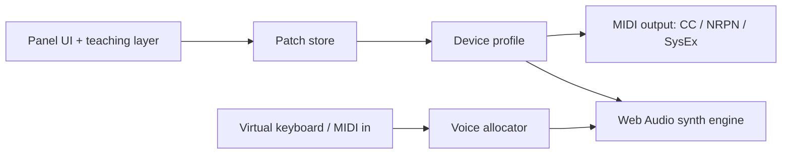

# Plan: multi-synth patch editor with a built-in teaching synth

Status: draft for review.

## Vision

Grow the app from a single-device editor into a browser-based patch editor for many
synths, plus a built-in Web Audio synth that doubles as a tool for learning synthesis.

Goals:

- Edit hardware synths over Web MIDI through per-device profiles.
- Play and edit a built-in synth with no hardware and no backend (works on GitHub Pages).
- Explain what each control does, with sound, so the app teaches as it is used.

Non-goals for the first iterations:

- Emulating any hardware synth's sound.
- Decoding full patch dumps (SysEx) for every device.
- Modulation matrix on the built-in synth.

## Current state

- `src/model/parameters.ts`: one hardcoded parameter list (`summitParameters`) with CC and NRPN
  addresses, ranges, labels, and sections. Unverified encodings are flagged.
- `src/model/patchStore.ts`: zustand store of values keyed by parameter id, built from that list.
- `src/midi/midiEngine.ts`: `SummitMidiEngine`, a singleton, with ports, channel, and send logic.
- `src/midi/codec.ts`, `src/midi/sysex.ts`: CC/NRPN encoding and Summit-specific SysEx requests.
- `src/App.tsx` (about 800 lines): UI with Summit-specific layout and copy.
- The target hardware is a Summit (confirmed by the owner). The editor exposes one set of patch
  controls, so Summit's independent A/B layers are not supported yet.

## Target architecture



### Device profile

A profile is plain data plus a few functions. The UI and store consume only this interface.

```ts
type DeviceProfile = {
  id: string                      // 'summit', 'ultranova', 'microbrute', 'webSynth', ...
  name: string
  parameters: ParameterDefinition[]   // existing type, plus optional `teaching` metadata
  sections: SectionLayout[]           // grouping and panel layout hints
  encode(param, value, channel): number[][]   // MIDI bytes; web synth returns []
  decodeIncoming?(data): { id: string; value: number } | null
  sysex?: { requestEditBuffer?: Uint8Array; validate(data): Result }
  capabilities: { modMatrix?: boolean; fetchPatch?: boolean; midi: boolean }
}
```

- Today's `summitParameters` becomes the first profile. Section names move from a closed union to
  per-profile strings.
- `patchStore` keys values by `profileId`, so switching devices keeps each device's edits.
- `SummitMidiEngine` becomes a generic `MidiEngine`. Device-specific bytes move into the profile.

### Web synth

- A `webSynth` profile whose output goes to an audio engine instead of MIDI.
- Engine (`src/audio/`): one `AudioContext`, a polyphonic voice allocator (8 voices), and per
  voice 2 oscillators (sine, saw, square, triangle) with detune, a lowpass filter (cutoff,
  resonance, envelope amount), amp and filter ADSR envelopes, and a shared LFO (pitch/filter).
- Parameter changes use `AudioParam` scheduling (`setTargetAtTime`) to avoid zipper noise.
- Notes come from the virtual keyboard and Web MIDI input. `AudioContext` starts on the first user
  gesture.
- The synth is tested by pure logic (voice allocation, envelope math, parameter mapping) in unit
  tests, and with `OfflineAudioContext` where practical.

### Teaching layer

- Per-parameter `teaching` metadata: a one-sentence explanation, a "try this" hint, and a
  suggested range to sweep.
- Signal-flow view (osc, mixer, filter, amp, effects) that highlights the stage a control belongs
  to.
- Guided lessons as data (`lessons/*.ts`): ordered steps that load a preset patch, highlight a
  control, and ask the user to change it ("open the filter cutoff while holding a note").
- Visualizers: waveform scope and filter-response curve driven by an `AnalyserNode` and the
  filter's frequency response.
- Teaching content applies to hardware profiles too, as tooltips, where the parameter maps to the
  same concept.

## Phases

1. **Profile refactor (no behavior change).** Introduce `DeviceProfile`, move the existing
   parameters into a `summit` profile, rename `SummitMidiEngine`, and add a device
   selector. All existing tests still pass.
2. **Web synth.** Audio engine, `webSynth` profile, keyboard and MIDI-in playing, device selector
   option, and a built-in preset set.
3. **Teaching layer.** `teaching` metadata, signal-flow view, scope and filter curve, first 3-5
   lessons (oscillators, filter, envelopes, LFO, putting it together).
4. **Rebrand.** New name and tagline, title and favicon, README rewrite, and Pages path decision.
5. **More devices.** Add the owner's other hardware to prove the abstraction, since it can be
   verified on real gear: the Novation Ultranova (same vendor, CC/NRPN-based, closest to the
   Summit profile) first, then the Arturia MicroBrute (monophonic, CC-based, a very different
   panel). Parameter maps must come from the manufacturers' published MIDI charts and be marked
   `unverifiedEncoding` until checked against the hardware.

Phases 1 and 2 are the foundation. Phases 3 and 4 can proceed in parallel after 2.

## Decisions needed

- **Name.** Decided: Zinth.
- **Repo and URL.** Decided: the repo is renamed to `zinth`, so Pages now lives at
  `/zinth/`. The workflow base path derives from the repo name. GitHub redirects the old
  repo URL but not the old Pages URL.
- **Summit layers.** Decided: A/B layer editing is deferred. Phase 1 stays behavior-neutral.
- **Device order.** Proposed: Summit, then Ultranova, then MicroBrute.
- **Trademark and attribution.** Use manufacturer names only descriptively ("works with ...").

## Risks

- Hardware parameter maps vary in quality. Keep the `unverifiedEncoding` flag and require
  hardware verification before enabling auto-send for new profiles.
- The panel UI in `App.tsx` is Summit-shaped. Splitting it into section components driven by
  profile layout data is the largest piece of phase 1.
- Web Audio behavior differs across browsers (autoplay policy, latency). Test in Chrome, Edge,
  Firefox, and Safari; Web MIDI itself remains Chromium-only.
- Scope creep. Keep the first web synth small, so lessons can be written against a stable
  parameter set.

## Verification

- Unit tests for profile encoding, store behavior per profile, voice allocation, and envelope math.
- Existing `test:run`, `test:layout`, `lint`, and `build` stay green at the end of every phase.
- Manual listening check for the web synth (no clicks, stuck notes, or runaway resonance).
